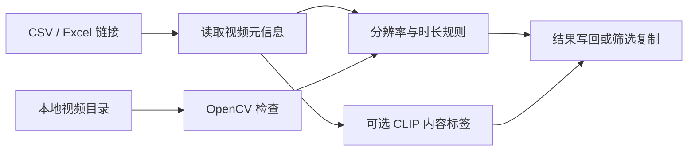

# VideoBatchFilter

批量检查视频素材规格与内容标签的 Python 工具。支持读取 CSV/Excel 中的在线视频链接，也支持扫描本地视频目录。

适合在素材入库、剪辑准备、内容审核和媒体资产整理前，先完成一轮可重复的规格检查。



## 项目状态

- 当前形态：Python 命令行批处理工具
- 输入：CSV、Excel 或本地视频目录
- 输出：规格结果、可选内容标签、错误信息或筛选后的文件
- 使用边界：内容标签是模型相似度结果，不能替代人工审核或高风险合规判断

## 两种工作模式

### 在线链接模式

从 CSV 或 Excel 读取链接，使用 `yt-dlp` 获取可用的视频元信息，并把结果写回原文件。

可检查：

- 最大分辨率
- 视频时长
- 标题和提取错误
- 可选 CLIP 内容标签：暴力、血腥、吸烟

### 本地文件模式

扫描本地视频目录，使用 OpenCV 检查：

- 分辨率
- 视频时长
- 文件大小

可以把符合条件的文件复制到单独的输出目录。

## 快速开始

建议使用 Python 3.10 或更高版本。

```bash
git clone https://github.com/Yang642514/VideoBatchFilter.git
cd VideoBatchFilter
python -m venv .venv
source .venv/bin/activate  # Windows: .venv\Scripts\activate
pip install -r requirements-minimal.txt
```

把 CSV/Excel 文件放入 `data/`。默认链接列名是历史字段 `vediolink`，可以通过 `--link-column` 指定其他列名。

```bash
# 批量处理 data/ 中的 CSV 和 Excel
python video_filter.py --batch

# 处理单个文件
python video_filter.py --excel my_links.csv --link-column video_url

# 持续监控当前进程启动后新增到 data/ 的文件
python video_filter.py --watch
```

Windows 用户也可以运行 `scripts/批量处理视频.bat`。

## 输入与输出

输入示例见 `data/example_links.csv`：

```csv
vediolink,video_title
https://example.com/media/video-001.mp4,示例素材 1
https://example.com/media/video-002.mp4,示例素材 2
```

处理后会在原 CSV/Excel 中补充标题、时长、最大分辨率、规格结果、可选内容标签、备注和错误信息等列。

链接模式会覆盖写回原文件。正式处理前请保留原始数据副本。项目使用临时文件完成 CSV 替换，但这不等于完整的数据备份或跨重启断点续传。

## 本地视频目录

本地模式需要安装完整依赖中的 OpenCV：

```bash
pip install -r requirements.txt
python video_filter.py --input ./input --output ./passed
```

不提供 `--output` 时只输出符合条件的文件列表，不复制文件。

## 配置

筛选条件和输出列名位于 `config.json`。默认最低分辨率为 `1920x1080`，时长范围为 10–3600 秒。

`min_size` 和 `max_size` 仅用于本地文件模式。链接模式不会下载完整视频来计算文件大小。

## 可选内容标签

安装 `torch`、`transformers`、`Pillow` 后，链接模式会尝试从缩略图判断暴力、血腥和吸烟标签。阈值位于 `config.json`。

这些结果来自模型相似度，不是人工审核结论，也不适合单独用于高风险合规决策。没有相关依赖时，内容标签检测会自动跳过。

## Cookie 与平台限制

部分平台或受限视频可能需要 Cookie。默认路径是本地 `cookies.txt`，该文件已加入 `.gitignore`。

Cookie 属于账号凭据，不要提交到 Git，也不要分享给他人。平台页面和反爬策略会变化，仓库不能保证所有平台、地区和时间都能稳定提取。

## 监控模式边界

`--watch` 只记录当前进程启动后已经处理过的文件。程序重启后不会恢复处理进度，因此它不是持久化断点续传。

## 目录结构

```text
video_filter.py             主 CLI 与处理流程
batch_process.py            Windows 友好的批处理入口
config.json                 输出列和筛选规则
data/example_links.csv      不含真实平台数据的输入格式示例
utils/                      数据处理与轻量提取器
scripts/                    Windows 批处理脚本
docs/                       安装与结构说明
```

## 许可证状态

仓库当前没有独立的开源许可证文件，因此未正式授予复制、修改或再分发许可。待作者选择许可证后再补充。
